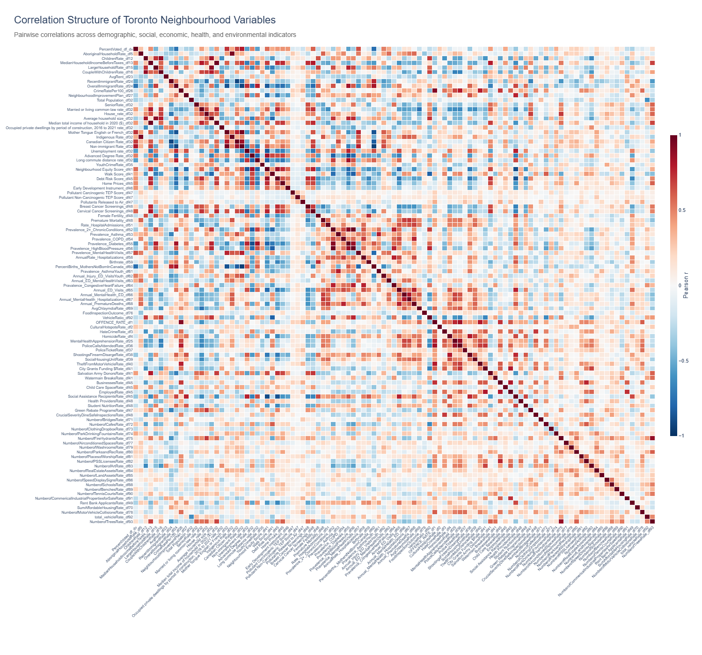

# Toronto Neighbourhoods Through 103 Public Indicators
## An exploratory analysis of how Toronto neighbourhood characteristics move together and what kinds of neighbourhood profiles emerge

Toronto publishes an enormous amount of neighbourhood level data. Demographics, housing, health, public safety, infrastructure, transportation, civic indicators, and municipal assets are often available separately, but it is much harder to see how those pieces fit together.

For this project, I combined dozens of public datasets into a single neighbourhood level table and used it to ask three broad questions:

1. What characteristics are associated with selected outcomes such as voter turnout?
2. Which neighbourhood characteristics tend to move together?
3. If I ignore the neighbourhood names and look only at the data, do groups of neighbourhoods with broadly similar profiles emerge?

The final dataset contains 140 historical Toronto neighbourhoods and 103 numeric indicators. The goal is exploratory rather than causal. The analysis is intended to reveal patterns worth investigating, not to rank neighbourhoods, claim that one characteristic causes another, or suggest that individual residents necessarily resemble the average of the neighbourhood where they live.

I provide the cleaned, preprocessed dataset with all variables linked to individual neighbourhoods, along with the complete analysis code, at the end of this article.

Public data sources:

- City of Toronto Open Data Portal (https://open.toronto.ca/)
- Canada Mortgage and Housing Corporation (https://www03.cmhc-schl.gc.ca/hmip-pimh/#Profile/1/1/Canada)
- Ontario Community Health Profiles Partnership (https://www.ontariohealthprofiles.ca/dataTablesON.php?varTab=HPDtbl&select1=7)

## Why I used Toronto's historical 140-neighbourhood geography

Toronto used 140 social planning neighbourhoods until 2022, when 16 high growth neighbourhoods were split to create the current 158 neighbourhood system. I use the historical 140 neighbourhood geography because many of the datasets in this project are available at that level.

This improves comparability across sources, but it also means the analysis should be interpreted as a synthesis of neighbourhood patterns across different periods rather than as a precise snapshot of Toronto today.

---

# Methodology

My first goal was to understand what patterns are associated with neighbourhood voting behaviour, operationalized as voter turnout.

The voter turnout data are organized by ward and voting subdivision. A voting subdivision is a small geographic area used to administer an election. A voter's residential address determines their ward and subdivision, which is then associated with an assigned voting place. Because subdivision numbers repeat across wards, the combination of ward and subdivision forms a composite key that uniquely identifies each geographic voting subdivision.

For these reasons, I needed a method to assign each voting subdivision to a neighbourhood. Voting subdivisions alone could not be used for the complete analysis because most of the other public datasets are available at the neighbourhood level.

## 1. Project the geographic layers into metres

The voting subdivision polygons, historical neighbourhood polygons, and ward polygons are loaded with GeoPandas and projected to **EPSG:26917**.

This matters because the next step involves calculating areas. Latitude/longitude coordinates are not suitable for interpreting polygon areas directly in square metres. the projected coordinate system allows the geographic overlap calculations to be performed in metre based units.

## 2. Assign each voting subdivision to a neighbourhood

Voting subdivisions do not line up perfectly with neighbourhood boundaries. A single subdivision can therefore overlap more than one neighbourhood.

The code intersects the voting subdivision polygons with the historical neighbourhood polygons and calculates the physical area of every overlap. Each voting subdivision is then assigned to the neighbourhood containing the largest share of its area.

In plain language, if most of a voting subdivision lies in Neighbourhood A but a smaller part falls inside Neighbourhood B, the entire subdivision is assigned to Neighbourhood A.

This is a practical approximation, but it introduces some geographic measurement error around neighbourhood boundaries.

## 3. Aggregate turnout

Across all voting subdivisions assigned to a neighbourhood, I sum the number of people who voted and the number of eligible electors.

Neighbourhood voter turnout is then calculated as:

**Turnout = total number voted / total eligible electors**

This turnout dataset is then joined with the other variables to create a master analytic file.

## 4. Building the variable dataset

The preprocessing notebook prepares and merges 69 predictor tables in addition to the voter turnout table.

The source material spans a wide range of topics, including:

- population and household composition
- immigration and citizenship
- income, employment, and social assistance
- housing and rents
- health conditions and health care use
- public safety and police activity
- environmental pollution
- transportation
- schools and child care
- social and affordable housing
- parks and recreation
- public art and cultural amenities
- municipal infrastructure
- public space amenities
- vehicles and collisions
- other neighbourhood services and assets

Different types of source data required different preprocessing strategies.

### Neighbourhood level datasets

When a source already includes a neighbourhood identifier, I map or aggregate it to the historical 140 neighbourhood geography.

When multiple current neighbourhoods map to one historical neighbourhood, total population is summed. Other selected neighbourhood profile measures are averaged across the component neighbourhoods. This is an approximation for rates and proportions. A denominator weighted reconstruction would be more exact when the required denominators are available.

### Point location datasets

Several datasets begin as individual locations rather than neighbourhood level summaries, including fire hydrants, drinking fountains, schools, benches, tennis courts, public art, and other municipal assets.

These records are converted to geographic points and spatially joined to the historical neighbourhood polygons. I then count the number of records falling inside each neighbourhood.

## 5. Converting raw counts into population normalized measures

Raw counts are often difficult to compare across neighbourhoods because neighbourhoods have different populations.

A neighbourhood with more residents would generally be expected to have more events, facilities, and service users.

For many variables, I therefore convert raw counts into population normalized measures. For example:

**Crime rate = crime total count / total population × 100**

The same general approach is used for measures such as police calls, shootings/firearm discharges, social housing units, social assistance recipients, rent bank applicants, and many municipal assets.

This improves comparability across neighbourhoods, but rates based on resident population require special caution in areas with large daytime, worker, visitor, or commuter populations. I return to this issue later.

## 6. The final analytic table

After preprocessing, the analysis uses 103 numeric indicators across 140 historical neighbourhoods.

The variables are measured in very different units. Some are dollars, some are proportions, some are rates, and some are counts normalized by population. For analyses such as K-means clustering, every variable is standardized into a z score.

A z score tells us how far a value is from the mean in standard deviation units:

- `0` = approximately the average neighbourhood
- `+1` = one standard deviation above the neighbourhood average
- `-1` = one standard deviation below the neighbourhood average

This puts all 103 variables onto a common numerical scale.

---

# Results

## The correlation matrix

The first analysis calculates the pairwise Pearson correlation between every pair of numeric indicators.

Pearson's r ranges from -1 to +1:

- values near +1 mean that two variables tend to be high in the same neighbourhoods
- values near -1 mean that neighbourhoods high on one variable tend to be low on the other
- values near 0 indicate little linear relationship

## False discovery rate correction

For a selected variable such as voter turnout, I calculate its Pearson correlation with every other indicator.

I then apply false discovery rate (FDR) correction and only display relationships surviving `q < .05`.

Why do this? When many statistical tests are performed at once, some will appear statistically significant simply by chance. FDR correction reduces this multiple testing problem while remaining less conservative than procedures designed to minimize virtually every possible false positive, such as Bonferroni correction.

Even after FDR correction, these remain descriptive neighbourhood level associations. They are not causal effects.

---

# Part 1: Voter turnout case study

The voter turnout correlations show that voting participation is embedded in a broader neighbourhood demographic and socioeconomic structure.

Neighbourhoods with higher voter turnout tend to have higher non immigrant shares, higher Canadian citizenship rates, higher English/French mother tongue shares, and stronger socioeconomic or preventive care indicators. Lower turnout neighbourhoods tend to show the opposite pattern, including higher immigrant/newcomer concentration, unemployment, and long commute measures.

A simple reading would be that neighbourhoods with larger immigrant populations also tend to have lower voter turnout. However, this is an ecological analysis: the unit of observation is the neighbourhood, not the individual resident. A correlation between neighbourhood immigrant share and neighbourhood voter turnout does not tell us whether a particular immigrant resident voted, whether that person was eligible to vote, or why the neighbourhood level association exists.

Citizenship eligibility, age, income, housing, mobility, length of residence, language, and many other factors overlap geographically. The appropriate interpretation is that voter turnout forms part of a larger neighbourhood pattern, not that one demographic characteristic independently determines voting behaviour.

Each variable can also be linked to the dataset used to generate it. Variable names end with `_df[number]`, and that dataset number can be linked to the `MasterList` data dictionary (see the final section). Interpreting some source variables still requires consulting that data dictionary, although I tried to make the variable names as descriptive as possible.

*Figure 1. Each bar shows the Pearson correlation between 2022 neighbourhood voter turnout and another neighbourhood indicator. Bars extending in the positive direction represent characteristics that tend to be higher in neighbourhoods with higher voter turnout, while bars extending in the negative direction represent characteristics that tend to be higher in lower turnout neighbourhoods. Longer bars indicate stronger relationships. Only correlations that remain statistically significant after false discovery rate correction (q < .05) are displayed.*

---

# Part 2: Recorded chlamydia rate case study

Another variable in the dataset is the recorded chlamydia rate. This should be interpreted as a measure of recorded chlamydia diagnoses rather than as a complete measure of sexually transmitted infections or individual sexual behaviour.

Applying the same correlation approach, recorded chlamydia rates also sit within a larger neighbourhood pattern.

Higher recorded chlamydia rates tend to co occur with several measures of police activity, crime, social assistance, social housing, and acute or mental health service use. Recorded rates tend to be lower in neighbourhoods with higher married/common law shares, more house based residential structure, and higher vehicle availability.

These associations may reflect many overlapping factors, including age structure, access to testing and health services, socioeconomic conditions, population turnover, and other neighbourhood characteristics. They should not be interpreted as evidence that any one associated characteristic causes higher recorded chlamydia rates.

*Figure 2. Each bar shows the Pearson correlation between a neighbourhood's recorded chlamydia rate and another indicator. Positive correlations indicate characteristics that tend to be higher in neighbourhoods with higher recorded chlamydia rates, while negative correlations indicate characteristics that tend to be higher where recorded rates are lower. The length of each bar represents the strength of the relationship, and only correlations surviving false discovery rate correction (q < .05) are shown.*

---

# Part 3: Social assistance recipients case study

The social assistance measure also shows a strong neighbourhood socioeconomic gradient.

Higher neighbourhood social assistance use tends to appear alongside unemployment, Neighbourhood Improvement Area designation, rent bank use, long commuting, several public safety indicators, and other measures of socioeconomic stress.

It tends to move in the opposite direction from neighbourhood equity, income, home prices, advanced education, and preventive care screening measures.

The important result is not that one of these variables causes another. Rather, multiple dimensions of socioeconomic and health vulnerability frequently co locate geographically.

*Figure 3. Each bar shows the Pearson correlation between neighbourhood social assistance use and another indicator. Positive bars identify characteristics that tend to be higher in neighbourhoods with greater social assistance use, while negative bars identify characteristics that tend to be higher where social assistance use is lower. Longer bars represent stronger correlations, and only relationships surviving false discovery rate correction (q < .05) are displayed.*

---

# Summary of case studies

These case studies show that neighbourhood voter turnout, recorded chlamydia rates, and social assistance use are each associated with many other neighbourhood level indicators.

The social assistance pattern is a useful example of why the unit of analysis matters. Neighbourhoods with higher rates of social assistance use also tend to have higher unemployment, higher levels of several recorded public safety indicators, and greater measured health burdens. This describes a geographic pattern across neighbourhoods. It does not imply that social assistance recipients themselves cause, experience, or are responsible for every characteristic associated with the neighbourhoods in which they live.

---

# Part 4: What moves together across Toronto neighbourhoods?

## Complete neighbourhood level correlation heatmap

The examples above focus on one selected variable at a time. The complete correlation matrix instead contains the pairwise relationship between every pair of variables in the dataset.

With 103 indicators, this produces thousands of pairwise comparisons. The purpose of the full matrix is exploratory: it provides a map of the dataset's overall correlation structure rather than treating every cell as a separate confirmatory hypothesis test.

See the interactive version of the full correlation matrix here:

https://toronto-neighbourhood-correlations-c5but5exhsfgyapafdyctq.streamlit.app/

Hovering over a cell shows the two variables, their Pearson correlation, and the raw p value.

*Figure 4. This correlation similarity matrix heatmap shows the Pearson correlation between every pair of the 103 neighbourhood indicators. Each square represents one pair of variables: the colour indicates whether the relationship is positive or negative, while stronger colours indicate correlations farther from zero. The diagonal represents each variable correlated with itself (r = 1). Large blocks of similar colour indicate groups of characteristics that tend to show similar or opposing geographic patterns across Toronto. The interactive version can be hovered over to see the two variables, Pearson correlation (r), and raw p value for each cell.*

---

# Part 5: Grouping the variables themselves

The full correlation matrix is difficult to interpret variable by variable. A natural next question is whether groups of indicators show similar geographic patterns across Toronto.

## Hierarchical clustering of variables
I convert the correlation matrix into a distance matrix:

**Correlation distance = 1 − Pearson r**

This gives an intuitive scale:

- two perfectly positively correlated variables (`r = 1`) have distance `0`
- two uncorrelated variables (`r = 0`) have distance `1`
- two perfectly negatively correlated variables (`r = -1`) have distance `2`

The resulting distances are clustered using average linkage hierarchical clustering.

A dendrogram then shows how individual indicators progressively merge into larger groups. Cutting the dendrogram at a correlation distance of 0.70 produces 17 variable clusters.

The cutoff should not be interpreted as saying that every pair of variables inside one cluster has the same correlation. With average linkage, clusters are merged based on the average distance between their members.

Some groups contain only one variable. This simply means that, at the chosen 0.70 distance cutoff, that indicator was not similar enough to another variable or cluster to merge with it.

## The 17 variable themes

I assigned short descriptive names after inspecting the variables belonging to each statistical cluster. I used ChatGPT to help generate concise candidate labels, then reviewed and revised the labels against the variables in each cluster.

| Cluster | Descriptive theme |
|---|---|
| C1 | Air Pollution Emissions & Non Carcinogenic Toxicity |
| C2 | Carcinogenic Pollution Burden |
| C3 | Family, Chronic Health & Socioeconomic Vulnerability |
| C4 | Immigration & Newcomer Concentration |
| C5 | Affordable Housing Availability |
| C6 | Clothing Donation Infrastructure |
| C7 | Socioeconomic Advantage, Civic Engagement & Preventive Care |
| C8 | Municipal Infrastructure & Public Space Assets |
| C9 | House Based Residential & Community Safety Infrastructure |
| C10 | Community Gathering & Social Infrastructure |
| C11 | Dense Urban, Commercial & Public Safety Activity |
| C12 | Social Housing & Acute Health Vulnerability |
| C13 | Public Amenities & Municipal Property Assets |
| C14 | Cultural Amenities |
| C15 | Population, Rent & Recent Housing Development |
| C16 | Municipal Land & Bridge Assets |
| C17 | Food Safety Outcomes |

Several of the larger groups are especially informative.

*Figure 5. This dendrogram groups the 103 indicators according to how similarly they vary across Toronto neighbourhoods. Each label on the left represents one variable, and branches show how variables or groups of variables progressively merge. Variables that join at a lower correlation distance (x axis) have more similar neighbourhood patterns. Variables that merge higher up are less similar. The horizontal cut at a correlation distance of 0.70 divides the tree into the 17 variable clusters discussed below. The coloured branches help show which variables belong to the same resulting group. The legend on the right describes cluster themes.*

### [C3] Family, chronic health, and socioeconomic vulnerability

Cluster C3 contains indicators related to larger households and children alongside fertility, unemployment, social assistance, rent bank use, Neighbourhood Improvement Area designation, long commutes, several chronic health conditions, hospitalization measures, and some serious public safety outcomes.

This does not mean that family structure itself represents vulnerability. Rather, these variables have sufficiently similar geographic patterns that they are grouped together statistically. Across the neighbourhoods in this dataset, larger family and child related measures tend to co occur geographically with greater economic hardship, higher measured chronic health burden, longer commutes, and more social service or public safety challenges.

### [C7] Socioeconomic advantage, civic engagement, and preventive care

C7 combines variables including income, home prices, advanced education, citizenship, non immigrant share, neighbourhood equity, voter turnout, cancer screening measures, and several related indicators.

The cluster suggests that neighbourhoods with higher incomes, more expensive homes, more advanced education, higher equity scores, and higher voter turnout also tend to have higher cancer screening rates and larger shares of residents who are Canadian citizens and non immigrants.

Again, the cluster summarizes co occurring neighbourhood characteristics. it does not identify a causal pathway among them.

### [C11] Dense urban, commercial, and public safety activity

C11 contains a large set of measures including businesses, employment, cafés, commercial properties, public art, Walk Score, police calls, offences, motor vehicle collisions, inspections, and health providers.

Neighbourhoods with more businesses, cafés, jobs, commercial properties, public art, and health providers also tend to have more police calls, offences, collisions, and inspections.

A plausible interpretation is urban intensity. These areas may have large numbers of people working in, visiting, and moving through them, so higher public safety or service activity does not necessarily mean that resident populations themselves are driving those patterns.

### [C12] Social housing and acute health vulnerability

C12 combines social housing concentration with hospital and emergency/mental health utilization, premature mortality, and related measures.

More specifically, the cluster links greater social housing concentration with higher hospital admissions, emergency and mental health service use, and higher premature mortality at the neighbourhood level.

These measures co-locate geographically, but the clustering does not establish that social housing itself causes worse health outcomes. Both may reflect broader structural and socioeconomic conditions.

## A note on the cluster names

The hierarchical clustering algorithm returns cluster membership numbers, not semantic names.

I used ChatGPT to help summarize the variable lists into concise descriptive themes, then reviewed and revised those labels against the actual variables.

Someone else could reasonably choose different wording for the same clusters. The statistical result is the cluster membership. the descriptive names used in this article are interpretations.

---

# Part 6: Grouping the neighbourhoods

This final analysis reverses the question. Instead of grouping variables according to how similarly they behave across Toronto, I group neighbourhoods according to how similar their overall 103-variable profiles are.

Neighbourhoods that end up in the same cluster share a relatively similar pattern across many social, economic, health, demographic, and urban characteristics. For example, one cluster might contain neighbourhoods that tend to have higher incomes, higher home prices, and stronger preventive health indicators, while another might contain neighbourhoods with more social housing and higher health service use.

The hierarchical clustering described in the previous section asks which variables tend to behave similarly across Toronto. This neighbourhood clustering analysis asks which neighbourhoods have similar overall profiles across all of the variables in the dataset.

## What K-means does

I use an unsupervised clustering algorithm called K-means.

K-means represents each neighbourhood as a point in a 103-dimensional space, with one dimension for each standardized indicator. The algorithm then searches for a partition that groups neighbourhoods with relatively similar multivariate profiles.

The algorithm repeatedly:

1. assigns each neighbourhood to the nearest cluster centre
2. recalculates each cluster centre
3. repeats the process until the assignments stabilize

## Missing value handling

Neighbourhoods occasionally have missing observations for individual indicators.

Before K-means, missing values are filled using median imputation. For each variable, a missing value is replaced by the median observed across neighbourhoods.

This allows all neighbourhoods to remain in the clustering analysis and is relatively resistant to extreme values. The drawback is that imputation makes a missing observation look relatively average. Variables with substantial missingness could contribute less meaningful information than variables observed everywhere.

## Standardization

After imputation, every variable is standardized before K-means.

Without standardization, a variable measured in dollars could dominate a variable expressed as a proportion simply because the dollar values are numerically much larger.

After standardization, every variable is represented in standard deviation units. This equalizes numerical scale, although it does not solve the separate problem that domains represented by many correlated variables may collectively receive more weight than domains represented by only a few variables.

---

# Part 7. Choosing eight neighbourhood clusters

I compared candidate K-means solutions using the silhouette score.

The silhouette score measures how well each neighbourhood fits within its assigned cluster compared with the nearest alternative cluster. Higher values indicate clearer separation.

The feature set does not imply that Toronto consists of a small number of perfectly isolated natural categories. K-means will produce a partition for any specified value of `k`, so the choice of cluster count requires interpretation.

The highest silhouette score occurs at `k = 3`, but that solution produces very broad groups that collapse several substantively different neighbourhood patterns together. I use eight clusters as a descriptive compromise. The silhouette score remains within the same relatively low range, while the additional clusters produce more differentiated and interpretable neighbourhood profiles.

Eight clusters should be viewed as an exploratory and presentation choice, not as the statistically optimal or uniquely correct number of neighbourhood types. The relatively low silhouette scores are also evidence that neighbourhoods overlap substantially in this high dimensional feature space rather than forming sharply separated natural categories.

---

# Part 8. The eight neighbourhood profiles

To understand each K-means cluster, I calculate the mean standardized value of every variable among the neighbourhoods belonging to that cluster.

I then rank indicators by the absolute magnitude of that cluster mean and display the ten largest deviations.

For example, if a cluster is `+1.5 SD` on household income, the average neighbourhood in that cluster is 1.5 standard deviations above the citywide neighbourhood mean on that indicator. A negative value means that the cluster falls below the citywide neighbourhood average.

The cluster labels below summarize those strongest deviations.

*Figure 6. The map assigns each of Toronto's 140 historical neighbourhoods to one of eight K-means clusters based on its overall pattern across all 103 indicators. The map colours correspond to the cluster numbers shown in the legend: neighbourhoods with the same colour belong to the same cluster and have relatively similar overall profiles.*

*The accompanying cluster cards show the ten variables that most strongly distinguish each cluster from the Toronto neighbourhood average. Values are expressed in standard deviations (SD): 0 SD represents the average across neighbourhoods, +1 SD means the cluster average is one standard deviation above the neighbourhood average, and −1 SD means it is one standard deviation below it. Up arrows indicate variables that are higher than the Toronto neighbourhood average for that cluster, while down arrows indicate variables that are lower. Larger absolute SD values indicate characteristics that more strongly distinguish that cluster.*

*The cluster colours and numbers are identifiers rather than rankings: Cluster 8 is not inherently better or worse than Cluster 1. Likewise, neighbourhoods within a cluster are similar across the complete 103 variable profile but are not identical.* 

*The legend on the right displays themes observed within each cluster. Neighbourhoods that fall within that cluster are displayed under the titles.*

## Cluster 1: Immigrant Dense Neighbourhoods with Lower Recorded Health Burden

The most distinctive features of Cluster 1 are demographic.

Compared with Toronto neighbourhoods overall, this group has:

- substantially lower English/French mother tongue share
- substantially lower non immigrant share
- lower Canadian citizenship rate
- a higher percentage of births to mothers born outside Canada

Several recorded health and health care indicators are also lower than average, including asthma prevalence, mental health related primary care visits, youth injury emergency department visits, mental health emergency department visits, and premature mortality.

These neighbourhoods have larger immigrant and newcomer populations and also tend to show lower recorded levels of several health problems and health care use measures. Because these are recorded measures, the pattern may reflect true health differences, differences in population composition, health care access or use, diagnosis, or other factors.

## Cluster 2: House Based & Youth/Health Burdened Neighbourhoods

Cluster 2 is characterized by a relatively house oriented residential pattern together with elevated youth- and health related measures.

Its defining characteristics include:

- higher house dwelling share
- higher Canadian citizenship share
- higher COPD prevalence
- higher youth crime rate
- higher youth injury emergency department visits
- higher premature death measures

The youth indicators require a specific caveat: they show that youth related outcomes are elevated, not necessarily that these neighbourhoods contain a larger proportion of young people.

## Cluster 3: Walkable, High Turnout & Lower Immigration Neighbourhoods

Cluster 3 stands out for:

- high Walk Score
- high 2022 voter turnout
- relatively high non immigrant share
- relatively high English/French mother tongue share
- fewer births to mothers born outside Canada
- lower vehicle availability
- lower prevalence of several cardiometabolic health measures

This profile combines urban form, civic participation, and demographic composition. These neighbourhoods tend to be more walkable and less car oriented, with higher voter turnout, larger non immigrant and English/French mother tongue shares, and lower recorded levels of several cardiometabolic health conditions.

## Cluster 4: Lower Equity & Socioeconomically Vulnerable Neighbourhoods

Cluster 4 shows one of the clearest socioeconomic vulnerability profiles.

Its strongest deviations include:

- a lower neighbourhood equity score
- a higher prevalence of Neighbourhood Improvement Area designation
- higher social assistance use
- higher unemployment
- lower advanced degree share
- longer commutes
- higher diabetes prevalence
- higher fertility
- elevated firearm discharge activity

These neighbourhoods show greater measured socioeconomic disadvantage, with unemployment, social assistance use, longer commutes, and lower advanced education rates tending to occur alongside higher measured health burdens and several serious public safety indicators.

## Cluster 5: Downtown Employment & Cultural Service Neighbourhoods

Cluster 5 has an unusually high employment, cultural, and service profile.

Its strongest characteristics include:

- extremely high public art density
- high City grant funding per resident
- very high employment per resident
- more bridges per resident
- high average rent
- low vehicle availability
- elevated commercial/industrial property activity
- a high share of recently constructed dwellings
- relatively low prevalence of several chronic health indicators

These are dense, high activity urban neighbourhoods with many jobs, cultural amenities, public investment, newer development, and expensive housing, alongside lower vehicle availability.

However, this cluster illustrates an important issue in central Toronto. A downtown neighbourhood can contain relatively few permanent residents while supporting enormous numbers of workers, visitors, businesses, and services. Dividing those activities by resident population can produce very high per resident values.

Those measures are not necessarily errors: they describe activity intensity relative to the number of people who live inside the boundary. But they should not be interpreted as though only residents use those services or spaces.

## Cluster 6: Affluent, High Equity & Preventive Care Advantaged Neighbourhoods

Cluster 6 is the clearest high socioeconomic advantage profile.

It is distinguished by:

- higher home prices
- higher household income
- higher neighbourhood equity score
- higher cervical cancer screening
- higher breast cancer screening
- lower unemployment
- shorter long distance commuting

These neighbourhoods are more affluent on average, with higher incomes and home values tending to occur alongside lower unemployment and higher recorded use of preventive health services.

## Cluster 7: Social Housing Concentrated & High Health Burden Neighbourhoods

Cluster 7 shows a strong combination of social housing concentration and acute health burden.

Its strongest distinguishing characteristics include:

- substantially elevated premature mortality
- high hospital admission rates
- elevated mental health hospitalizations
- elevated mental health emergency department use
- higher recorded chlamydia rate
- substantially more social housing units per population
- lower vehicle availability
- lower married/common law share
- much lower house dwelling share

This is one of the clearest examples of multiple social and health indicators clustering geographically. Higher hospital use, mental health emergencies, premature mortality, and other measured health challenges tend to occur in the same neighbourhoods as greater social housing concentration, lower vehicle availability, and less house based residential structure.

Again, these are neighbourhood level associations and should not be interpreted as evidence that social housing causes the health outcomes in the cluster.

## Cluster 8: High Intensity Urban & Public Safety Activity Neighbourhoods

Cluster 8 is distinguished by unusually high levels of several urban activity and public safety indicators.

These include:

- mental health apprehensions
- theft from motor vehicles
- DineSafe inspection activity
- recorded hate crime rate
- police calls attended
- overall offence rate
- another broad crime rate measure
- City grant funding
- recorded chlamydia rate
- very low vehicle availability

These are highly active urban neighbourhoods where police, public safety, inspection, and health related activity are concentrated. The strongest interpretation is not simply "high crime."

As with Cluster 5, resident population may be relatively small compared with the number of people who work in, visit, or travel through these neighbourhoods.

---

# Part 9. What the analysis does and does not show

The main finding of this project is not any single correlation or cluster. It is that Toronto neighbourhood characteristics are deeply interconnected.

Income, housing, immigration, health, transportation, infrastructure, public safety, and civic participation often vary together. This means that simple one variable explanations can be misleading. For example, a neighbourhood level relationship between voter turnout and immigrant share may also reflect differences in citizenship eligibility, age, income, education, housing, mobility, or length of residence.

The correlation analysis shows which characteristics tend to rise and fall together across neighbourhoods. The hierarchical clustering shows which variables share similar geographic patterns. The K-means analysis shows which neighbourhoods have relatively similar overall profiles across all 103 indicators.

None of these analyses establishes cause and effect. A strong relationship between two variables does not mean that one causes the other, and the neighbourhood clusters should not be interpreted as fixed or definitive categories.

The results also apply to neighbourhoods, not individual people. A neighbourhood level relationship cannot automatically be used to describe the behaviour or characteristics of individuals who live there. Recorded measures such as crime, healthcare use, or disease rates can also be influenced by service availability, reporting, policing, population composition, diagnosis, and the number of people who work in or visit an area.

Finally, the datasets come from different years and sources, and some indicators share common denominators or measure closely related concepts. These factors may contribute to some of the observed correlation structure.

The analysis is best understood as a map of associations: it shows which characteristics tend to occur together, how broader neighbourhood patterns are structured, and where more focused questions may be worth exploring.

A useful next empirical question is not simply, "What is correlated with what?" but, "Why do these patterns appear, and do they remain when we control for other factors, account for spatial structure, or analyze the data in different ways?"

---

# Part 10. Limitations

## 1. Some 158-to-140 neighbourhood aggregations are approximate

Some datasets use the newer 158-neighbourhood classification, so mapping them to the historical 140-neighbourhood classification requires combining measures for some areas.

For some neighbourhood profile variables, this was done using a simple mean. For many rates and proportions, a denominator weighted reconstruction would be more exact if the appropriate denominators were available.

## 2. The datasets come from different time periods

This project is not a single year snapshot.

It combines election, Census/neighbourhood profile, health, public safety, infrastructure, and other datasets collected over different years.

The analysis assumes that enough of the relative geographic structure persists across time to make exploratory comparison useful. That assumption is more plausible for slowly changing characteristics than for rapidly changing outcomes.

## 3. Boundary crossing voting subdivisions are assigned to one neighbourhood

A voting subdivision that overlaps two neighbourhoods is assigned entirely to whichever neighbourhood contains the largest share of its area.

This introduces some measurement error around neighbourhood boundaries.

## 4. Missing data are median imputed for K-means

Median imputation keeps all neighbourhoods in the clustering model, but missing observations are pushed toward the centre of the distribution.

A future technical appendix could include a missingness table so readers can see which indicators rely most heavily on imputation.

## 5. Correlated domains can receive disproportionate weight in K-means

Every standardized variable receives one dimension in the Euclidean distance calculation.

That means a domain represented by many correlated variables, such as health, can collectively influence distance more strongly than a domain represented by only one or two measures.

Possible future approaches include dimensionality reduction within conceptual domains, factor analysis, or explicit domain weighting. Running PCA before K-means would be another defensible sensitivity analysis, although it would trade some direct variable level interpretability for lower dimensional structure.

## 6. Resident population denominators can distort high activity areas

Many event, service, infrastructure, and amenity measures are divided by resident population.

This is useful for comparing neighbourhoods of different residential population sizes, but it can produce very large rates in downtown or employment heavy areas where the daytime population greatly exceeds the number of permanent residents.

Some resulting measures may therefore capture activity intensity per resident rather than the exposure or behaviour of residents themselves.

## 7. Many variables share the same population denominator

Different count variables are often divided by the same population estimate.

This can introduce correlation structure associated with a shared denominator in addition to the underlying relationships among the events being measured.

## 8. Spatial autocorrelation is not explicitly modelled

Neighbourhoods are not independent observations randomly scattered across space.

Nearby neighbourhoods can share housing stock, transit access, demographics, infrastructure, and services.

The standard Pearson p values and FDR procedure do not explicitly account for spatial dependence, so the apparent statistical evidence may be stronger than it would be under a spatial model.

## 9. Neighbourhood relationships are not individual level relationships

This is the ecological fallacy problem.

If neighbourhoods with a high value on one demographic variable also have lower turnout, that does not establish that individuals belonging to that demographic group are less likely to vote.

The same caution applies to health, crime, social assistance, immigration, and every other aggregate relationship in the analysis.

## 10. Eight K-means clusters are a descriptive summary, not ground truth

K-means will produce a partition whenever it is asked to do so.

The eight cluster solution is useful because it compresses a high dimensional dataset into an interpretable map, but neighbourhoods exist on a continuum. The fact that `k = 3` produced the highest silhouette score also means the eight cluster solution should not be described as the statistically optimal solution.

A neighbourhood near a cluster boundary may resemble neighbourhoods in another cluster almost as much as those in its assigned group.

## 11. Cluster names are interpretations

Neither hierarchical clustering nor K-means generates semantic names.

The statistical output consists of variable or neighbourhood memberships. Names such as "socioeconomically vulnerable," "downtown employment," or "preventive care advantaged" are concise interpretations of the variables that most strongly distinguish each group.

They should be read as descriptive summaries, not as formal classifications supplied by the algorithms themselves.

## 12. Correlations are bivariate

The correlations do not control for other neighbourhood characteristics.

A relationship between two variables may weaken, disappear, or reverse after accounting for related demographic, socioeconomic, temporal, or geographic factors.

---

# Part 11. Conclusion

Toronto does not reduce neatly to a few completely separate kinds of neighbourhood.

What the data do reveal is a dense web of relationships among demographics, socioeconomic conditions, health, urban form, mobility, infrastructure, services, civic participation, and public safety activity.

The correlation matrix shows those relationships variable by variable. The dendrogram compresses the 103 indicators into 17 broader groups with similar geographic patterns. The K-means map provides an eight profile summary of how neighbourhoods resemble one another across the full high dimensional dataset.

The substantive value of the project is not a claim that these patterns are novel causal discoveries. It is the integration of many public datasets into a common geographic framework, the visualization of their shared structure, and the identification of neighbourhood-level patterns that can motivate more focused analyses.

Full preprocessed dataset, analysis code, and data dictionary:

https://github.com/epheva/toronto-neighbourhood-correlations

---
